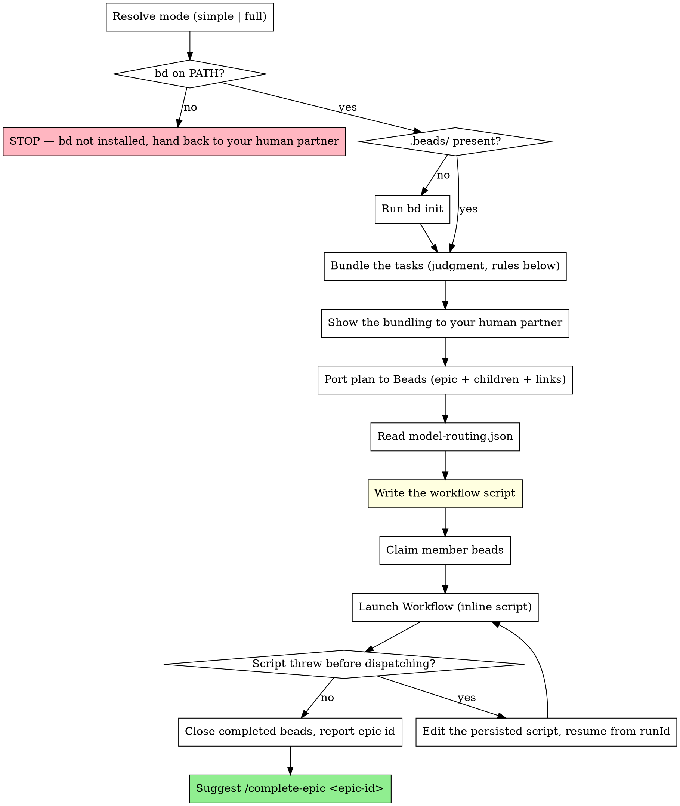

# Orchestrating Execution

**Announce at start:** "I'm using the orchestrating-execution skill to run this plan."

You are the coordinator. You do not implement anything. You do three things: port the plan into
Beads, **write a Workflow script for this specific plan**, and clean up after it returns. Every line
of production code in this run is written by agents that script dispatches.

**You author the script.** There is no `orchestrate.js` to feed. Earlier versions of this skill
handed a rigidly-shaped `args` object to a fixed script, and the run died on the shape far more
often than on the work — a missing tier, an integer where a bead id belonged, a bundle order the
validator disliked. All of that was ceremony in service of a script that could not see the plan.
Now the script is written against the plan in front of you, with the bead ids, the bundles and the
routing baked in as literals. Nothing to marshal, nothing to validate, no arg contract to violate.

**What is still fixed** is the *pipeline*: what runs, in what order, at what tier, and why. That is
the accumulated finding of this flow and it is below. Adapt the script; do not redesign the
pipeline on a whim.

## Pre-flight: is this plan orchestrable?

<HARD-GATE>
Orchestration runs the whole plan inside ONE background Workflow. Its implementer agents are
workflow-dispatched agents, and such an agent's toolset does **not** include `Agent` or `Workflow`
(verified 2026-08-15: a probe agent reported its tools as Artifact, Bash, Edit, ListAgents, Read,
ReportFindings, Skill, SendUserFile, ToolSearch, Write, StructuredOutput — no `Agent`, no
`Workflow`). Two consequences that are absolute, not probabilistic:

- **A workflow cannot nest a workflow** (`workflow()` inside a child throws; the Workflow tool is
  also absent from implementers). So a plan task that launches its own Workflow cannot run here.
- **An implementer agent cannot spawn sub-agents.** No `Agent` tool. So a plan task that fans out
  work across parallel agents (map-reduce over many items, an inference sweep, a judge panel) cannot
  run here either.

**Before Step 1, scan the plan's task steps for either pattern** — any step that says "run X as a
Workflow", invokes the `Workflow`/`Agent` tool, or describes a parallel agent fan-out. If ANY task
needs it, orchestration is the wrong vehicle: STOP and route to `subagent-driven-development`
instead, where the coordinator session (which *does* hold `Agent`/`Workflow`) launches each fan-out
and gates between tasks. Tell your human partner plainly *why* — it is a capability wall, not a
preference — and do not burn a long background run discovering it deep inside a task.

Everything an implementer CAN do it does through `Bash`, `Read`, `Edit`, `Write` (and MCP tools via
`ToolSearch`): build, test, run scripts, commit. A plan whose every task is self-contained code +
shell work is a good fit. A plan that orchestrates *other agents* is not.
</HARD-GATE>

## The Process



## Step 1: Resolve the mode

Your human partner already chose at the handoff:

| Handoff option | Pipeline |
|---|---|
| Orchestrated — Simple | Implement → deterministic gate → one combined review-and-fix pass → bounded test loop |
| Orchestrated — Full | Implement (reviews overlapped) → deterministic gate → per-unit + whole-plan review → routed fixes → test loop → refactor *only on structural findings* → test loop |

Do not ask which mode; it was chosen. The mode decides which phases you write into the script — in
Simple mode you simply omit the Review and Refactor blocks rather than branching on a variable.

You also need the plan document and its task file. They are co-located:
`docs/superpowers/plans/<name>.md` and `docs/superpowers/plans/<name>.md.tasks.json`. If the
`.tasks.json` is missing, STOP — there is nothing to bundle, and `writing-plans` should have written
it.

**Workspace:** the workflow's agents commit as they go, and the test loop deliberately leaves the
branch intact when it gives up. If you are on `main`/`master`, use
`claude-superpowers:using-git-worktrees` first, or get your human partner's explicit consent to run
here. Do not silently orchestrate a dozen agent commits onto a shared branch.

## Step 2: Beads check

```bash
command -v bd && test -d .beads && echo BEADS_OK
```

Both must hold. Beads is the durable record for the whole run: implementer prompts tell agents to
run `bd show <id>` for their task detail, Implement-phase commits are prefixed with the task id, and
the fix, test and refactor commits are prefixed with the epic id.

**No `.beads/` directory, but `bd` is on PATH — initialise it, do not ask.**

```bash
bd init
```

A missing tracker in a repo that has `bd` available is a setup gap, not a decision. `bd init` is
cheap, local, reversible (`rm -rf .beads`), and creates nothing outside the repo except the hooks it
installs deliberately. Announce that you ran it — "no `.beads/` here, ran `bd init`" — and continue.
If `bd init` itself fails, treat it as the `bd`-missing case below.

**No `bd` on PATH — STOP.** You cannot install it and must not guess a package manager. Tell your
human partner that orchestrated execution needs the `bd` binary, show what `command -v bd` returned,
and hand the decision back. Offer the alternative plainly: subagent-driven execution needs no
tracker.

**Untracked mode** is not offered as a routine choice — it exists only if your human partner asks
for it after being told there is no durable record and `/complete-epic` is unavailable afterwards.
It is now mechanically trivial (see the note at the end of Step 6), but that does not make it
equivalent. `bd init` is the answer whenever `bd` exists.

If you do need to ask your human partner anything at this point, the literal token `CLARIFICATION`
must appear in the question text. The `pre-askuser-handoff-guard` hook is still armed here
(writing-plans ran, tasks were created), and that token is its escape hatch. Without it the hook
blocks the call and teaches you to re-issue the execution handoff menu, which would loop you back
into this skill.

## Step 3: Bundle the tasks

A bundle is a set of tasks handed to ONE implementer agent in ONE dispatch. Read the
`.tasks.json` — each task carries `blockedBy` and a `json:metadata` fence with `files[]` and
`modelTier`.

**The default is one task per bundle.** Measurement of 240 workflow agents found cost is the
integral of context over turns, so it grows superlinearly with agent lifetime: the worst observed
agent ran 443 turns and moved 208M tokens, 20% of its entire run. A fresh agent's floor is ~26k
tokens. Merging tasks builds long agents; splitting them is close to free.

| Rule | Force | Why |
|---|---|---|
| One task = one bundle | **Default** | Agent lifetime is the dominant cost term. The floor for an extra agent is ~26k tokens; the marginal turn of a long agent costs 300-700k. |
| Never merge tasks of different `modelTier` | Absolute | The bundle is one dispatch at one model. Mixing tiers means paying frontier for mechanical work, or worse, the reverse. |
| Merge two tasks ONLY when all three hold: both trivially small, they share a file in `files[]`, AND they are joined by a direct `blockedBy` edge | Rare exception | All three together mean the second agent would otherwise re-derive the first's work immediately. Any one or two of them is not enough. |
| Never merge more than 2 tasks into one bundle | Absolute | Three merged tasks is the shape that produced the 443-turn agent. |
| A shared file creates a **notes-chain obligation**, not a merge | Mandatory | Implementation is sequential, so two agents never write one file concurrently. The real risk is the second agent not knowing the interface moved — which the notes chain fixes, at no cost in agent lifetime. |

"Trivially small" is mechanical, not a judgment call: a task whose `files[]` has at most 2 entries
AND whose `estimatedScope` is `"small"` (or absent). If either condition fails, the task stands
alone. This keeps the exception from re-growing into the rule it replaced.

**Why the old rule is gone.** Until 2026-08-15 this skill said tasks sharing a file MUST merge,
because "two agents writing one file clobber each other". That hazard does not exist here —
implementation is sequential and there are never two concurrent writers. The rule's only real
effect was building long-lived agents.

**Vocabulary:** the reference script in §6b calls these `UNITS` rather than bundles, because under
the default rule a bundle is usually exactly one task. "Bundle" and "unit" mean the same thing.

Then order:

- **Within a bundle** (only ever 2 tasks), list the blocking task first. Never numerically.
- **Across bundles**, emit them in an order where every bundle's dependencies appear earlier. The
  script implements bundles in array order and trusts it.

**If you cannot produce an acyclic bundle order**, do not force it. With one task per bundle the
bundle graph is isomorphic to the task graph, so a cycle at bundle level means a cycle in the
plan's own `blockedBy` edges — or that a merge you made pulled a dependency backwards. Say
exactly that to your human partner and name the tasks involved. The remedy is a plan change —
break the dependency cycle, or split the merge you made — and it is their call, not yours.

## Step 4: Show the bundling

Print it before you write a line of script — this is the cheapest moment in the run to catch a
bundling mistake. A short table: bundle id, tier, task ids, and — for any bundle holding 2 tasks —
which of the three merge conditions justified it. Say plainly that implementation runs bundles in
that order, that the default is one task per bundle, and that any merge you made must name all
three conditions.

## Step 5: Port the plan into Beads

Create the epic:

```bash
EPIC=$(bd create "<plan title>" -t epic -p 1 --external-ref "docs/superpowers/plans/<name>.md" --json | jq -r '.id')
```

Then one child per task in `.tasks.json`, in plan order. Write each task's body to a temp file
first — descriptions contain backticks, quotes and newlines, and quoting them inline is where this
step breaks:

```bash
# $BODY and $ACC are paths to temp files holding the task's Goal/Files/Steps text and its
# Acceptance Criteria block. There is no --acceptance-file, hence the cat.
bd create "<task subject>" --parent "$EPIC" -t task -p 2 \
   --body-file "$BODY" --acceptance "$(cat "$ACC")" \
   --external-ref "docs/superpowers/plans/<name>.md#task-<planTaskId>" --json | jq -r '.id'
```

- The body is the task's full **Goal / Files / Steps**, not a summary. The implementing agent reads
  this via `bd show` and nothing else — a one-line description makes it improvise. `-d "<text>"` is
  the shortcut for a genuinely short, quote-free body; `--body-file` (or `--stdin`) is the default.
- `--acceptance` gets the Acceptance Criteria block.
- Priority: `-p 2` for every child unless the plan says otherwise. Execution order comes from your
  bundling and the dependency links, never from priority.

<HARD-GATE>
**The `#task-<planTaskId>` fragment on `--external-ref` is mandatory, not decoration.** It is the
plan-task-id → bead-id map, written into durable storage at the moment the pairing is known.
`.tasks.json` ids are integers (`10`, `11`, …); bead ids look like `myproj-9rm.1`. You need that map
to turn your bundles into script literals, and there is no other way to recover it: creation order
is not queryable, and a coordinator that batches the creates, compacts, or resumes after an
interruption has nothing left to correlate.
</HARD-GATE>

Rebuild the map at any later point — always do this rather than trusting memory:

```bash
bd list --parent "$EPIC" --json | jq -r '.[] | [(.external_ref | split("#task-")[1]), .id, .title] | @tsv'
# 13   myproj-9rm.1   Task 4: The orchestrating-execution skill
```

Replay each task's `blockedBy`:

```bash
bd link <blocked-bead-id> <blocker-bead-id>
```

<HARD-GATE>
**`bd link A B` means B blocks A.** The blocked task comes FIRST. Reversing the arguments inverts
the dependency graph silently — `bd` prints a cheerful success line either way. Before you run each
link, say the sentence out loud in your head: "A is blocked by B." If the plan says task 13 is
blocked by task 11, the command is `bd link <bead-for-13> <bead-for-11>`.
</HARD-GATE>

Bundles are never modelled in Beads. The bundling lives only in the script you are about to write.

**Agents never close beads.** Not implementers, not fixers, not reviewers. Only this skill
transitions a bead to closed, and only in Step 8. That rule is carried into every agent prompt by
the `CTX` block below.

## Step 6: Write the workflow script

### 6a. Read the routing map

```bash
cat docs/superpowers/model-routing.json 2>/dev/null || cat ~/.claude/superpowers/model-routing.json
```

Project file first, then the user-level file. First one found wins entirely — no merging.

<HARD-GATE>
If neither file exists, STOP. Do not invent a mapping and do not name a model from memory. Tell your
human partner that orchestrated execution needs `docs/superpowers/model-routing.json` and that
`/onboard` writes it. Model ids live in that file and nowhere else — not in this skill, not in your
head. Copy the strings out of the file into the script; never type one.
</HARD-GATE>

A tier mapped to `"inherit"` means *omit the `model` option on that dispatch* so it runs at session
level. The file may also carry an `effort` map (`{"mechanical":"low","standard":"medium"}`) — apply
it per dispatch via `agent()`'s `effort` option. Capability and effort are independent dials: if a
task outgrows its tier, escalate the tier, never the effort.

### 6a-bis. Carry the plan's area briefs into the script

The plan document has a `## Code Areas` section with one `### Area: <slug>` brief each, and every
task's `json:metadata` carries an `"areas"` list. Copy them across:

- Each brief becomes an entry in the script's `AREA` map, verbatim, as a template literal.
- Each unit's `areas` array is the union of its task(s)' `areas` values.
- `briefFor(unit)` then inlines only the briefs that unit actually touches. **Do not pass every
  brief to every agent** — the brief is re-read on every turn of that agent, so an irrelevant one
  is a pure tax.

If a brief exceeds ~1500 tokens, cut it down here rather than passing it through. If the plan has
no `## Code Areas` section (older plans), set `AREA = {}` and `areas: []` on every unit; the
pipeline degrades to the previous behaviour rather than failing.

Backticks inside a brief must be escaped for the template literal, or the script will not parse.

### 6b. The reference script

This is the pipeline, in full, for Full mode. Adapt it — bake in your bundles, your bead ids, your
routing, your `CTX`; delete the Review and Refactor blocks for Simple mode and add the combined
review-and-fix pass in their place (shown at the end). Do not restructure the phase order.

```js
export const meta = {
  name: "orchestrated-execution",
  description: "Implement <plan title>: implement, gate, review, fix, test, conditional refactor",
  phases: [
    { title: "Implement", detail: "one agent per task, notes chained, reviews started inline" },
    { title: "Gate",      detail: "typecheck + lint, deterministic, before any LLM review" },
    { title: "Review",    detail: "design and correctness only" },
    { title: "Fixes",     detail: "routed to the owning unit, sequential" },
    { title: "Test",      detail: "verify, then a bounded fix loop" },
    { title: "Refactor",  detail: "only when review found something structural" },
  ],
};

// ---- Baked in at authoring time. No args, no filesystem: self-contained.
const EPIC   = "myproj-9rm";
const MODEL  = { mechanical: "<from routing file>", standard: "<…>", frontier: "<…>" };
const EFFORT = { mechanical: "low", standard: "medium", frontier: "inherit" };

// Area briefs from the plan's Code Areas section. Cap each at ~1500 tokens.
const AREA = {
  "sim-core": `<the plan's brief for this area, verbatim>`,
  "ui":       `<the plan's brief for this area, verbatim>`,
};

const CTX = `Project conventions:
- <the binding rules from CLAUDE.md: language, test command, commit style, house patterns>
- <the plan's Global Constraints, verbatim>
- Work on the current branch. Commit as you go. Never force-push, never rebase shared history.
- Claim nothing and close nothing in the tracker; the coordinator owns bead status.

Turn discipline — this is a hard cost constraint, not a style note. Every tool call is a turn, and
a turn re-reads your whole accumulated context. Late turns cost 300-700k tokens each.
- Batch shell work. Combine independent commands into ONE Bash call with && or ;.
- Do NOT run the full test suite. Run ONLY the narrow test for your own task. Full verification is
  a separate agent's job and it will happen.
- Never re-run a command to "check progress". Run it once, read the result.
- Prefer one Read of a whole file over several greps around it.
Do NOT run bd close.`;

// One entry per task. Merging is the rare exception, not the default.
const UNITS = [
  { id: "t1", tier: "mechanical", beads: ["myproj-9rm.1"], areas: ["sim-core"] },
  { id: "t2", tier: "standard",   beads: ["myproj-9rm.2"], areas: ["sim-core", "ui"] },
];

const FINDINGS = {
  type: "object",
  properties: { findings: { type: "array", items: {
    type: "object",
    properties: {
      file:     { type: "string" },
      issue:    { type: "string" },
      severity: { type: "string", enum: ["critical", "major", "minor"] },
      unitId:   { type: "string" },
      structural: {
        type: "boolean",
        description: "true only if fixing this requires moving a boundary, removing duplication " +
                     "across units, or replacing an abstraction. Behavioural bugs are false.",
      },
    },
    required: ["file", "issue", "severity", "structural"],
  } } },
  required: ["findings"],
};
const TESTRES = {
  type: "object",
  properties: { pass: { type: "boolean" }, summary: { type: "string" } },
  required: ["pass", "summary"],
};

// tier `null` = no model override, i.e. session level (used for the whole-plan review).
const dispatch = (prompt, { tier, label, phase: ph, schema }) => {
  const model  = tier ? MODEL[tier]  : null;
  const effort = tier ? EFFORT[tier] : null;
  log(`dispatch ${label} — tier=${tier ?? "session"} model=${model ?? "inherit"} ` +
      `effort=${effort ?? "inherit"} spent=${budget.spent()}`);
  return agent(`${CTX}\n\n${prompt}`, {
    label, phase: ph,
    ...(model  && model  !== "inherit" ? { model }  : {}),
    ...(effort && effort !== "inherit" ? { effort } : {}),
    ...(schema ? { schema } : {}),
  });
};

const briefFor = (u) => (u.areas || []).map((a) => `### Area: ${a}\n${AREA[a] || "(no brief)"}`).join("\n\n");

// ---- Implement: sequential (the notes chain needs it), but each unit's review is
// started immediately and left running while the next unit implements. That removes
// the Implement->Review barrier without letting two agents write concurrently.
phase("Implement");
const notes = [];
const reviewPromises = [];
for (const u of UNITS) {
  const r = await dispatch(
    `Implement beads task(s) ${u.beads.join(", ")} (unit ${u.id}, epic ${EPIC}).
Run \`bd show <id>\` for the full description and acceptance criteria. Implement completely,
including the tests named in acceptance criteria. Run ONLY those tests — not the full suite.
Commit with the task id as the message prefix.

Code areas you are working in:
${briefFor(u)}

Notes from previously implemented units:
${notes.length ? notes.join("\n") : "(none — you are first)"}

Return a SHORT summary (5-10 lines): what you built, key files, deviations, and — mandatory — any
interface named in your area brief that you CHANGED, so later units are not working from a stale
brief.`,
    { tier: u.tier, label: `impl:${u.id}`, phase: "Implement" }
  );
  notes.push(`${u.id} (${u.beads.join(",")}): ${r || "(agent returned nothing)"}`);

  // Not awaited: this review runs while the next unit implements.
  // .catch at PUSH time, not at collection. The collection point is hours away, and until
  // something handles it a rejected promise is an unhandled rejection. Promise.all is also
  // fail-fast: without this, one failed reviewer discards every other review.
  reviewPromises.push(dispatch(
    `Review the commits for beads task(s) ${u.beads.join(", ")} (unit ${u.id}). Read each task,
then review THIS UNIT'S COMMITS — use \`git show\`/\`git diff\` over them, NOT the current working
tree. Later units and the gate agent are committing while you read; the working tree is not what
you are reviewing.

Report REAL defects of DESIGN and CORRECTNESS only: logic errors, acceptance criteria not met,
broken or missing tests, unsafe assumptions, duplicated logic.
Do NOT report anything a typechecker or linter catches — unused imports, formatting, missing type
annotations, obvious null checks. A deterministic typecheck/lint gate runs on this branch before
any of your findings are acted on. Reporting them wastes a fix agent.

Set unitId="${u.id}" on every finding. Set structural=true ONLY when the fix requires moving a
boundary, removing cross-unit duplication, or replacing an abstraction.`,
    { tier: "standard", label: `review:${u.id}`, phase: "Review", schema: FINDINGS }
  ).catch(() => null));
}

// ---- Gate: deterministic checks, once, at the cheapest tier. Runs before we read
// any LLM review so that lint-class noise never becomes a routed fix.
phase("Gate");
const gate = await dispatch(
  `Run this project's typecheck and linter across the whole repo — NOT the test suite.
Fix everything they report. These are mechanical fixes; do not redesign anything.
Run the checks once more to confirm clean, then commit as "${EPIC}: gate fixes".
If both were already clean, change nothing and say so.`,
  { tier: "mechanical", label: "gate:typecheck-lint", phase: "Gate" }
);
log(`gate: ${gate ? "done" : "agent returned nothing"}`);

// ---- Review: collect the overlapped per-unit reviews, then one whole-plan pass.
phase("Review");
const perUnit = await Promise.all(reviewPromises);
const epicReview = await dispatch(
  `Whole-plan review of epic ${EPIC}. Read the codebase and the full git log for this plan.
Focus on what per-unit review structurally cannot see: cross-unit integration bugs, architecture
drift, duplicated logic between units, invariants broken in aggregate.
Do NOT report anything a typechecker or linter catches.
Leave unitId unset on findings that span units or belong to none. Set structural=true only per the
schema's definition.`,
  { tier: null, label: "review:plan", phase: "Review", schema: FINDINGS }
);
const findings = [
  ...perUnit.filter(Boolean).flatMap((r) => r.findings || []),
  ...((epicReview && epicReview.findings) || []),
];
log(`${findings.length} review findings (${findings.filter((f) => f.structural).length} structural)`);
// A finding with no `structural` key is falsy but is NOT a claim that it is non-structural.
const missingFlag = findings.filter((f) => f.structural === undefined).length;
if (missingFlag) log(`WARNING: ${missingFlag} finding(s) missing the structural flag — counted as non-structural`);

// ---- Fixes: routed to the unit that owns them, sequential. Sequential because two
// fixers could otherwise write the same file — unlike review, fixing is not read-only.
phase("Fixes");
const fmt = (f) => `- [${f.severity}] ${f.file}: ${f.issue}`;
const fixNotes = [];
for (const u of UNITS) {
  const own = findings.filter((f) => f.unitId === u.id);
  if (!own.length) continue;
  const fr = await dispatch(
    `Apply these review findings for unit ${u.id}. Verify each against the code first — skip any
that are wrong. Run only the tests covering what you touched, then commit as
"${EPIC}: fixes ${u.id}".
${own.map(fmt).join("\n")}

Return which findings you fixed and which you rejected, with reasons.`,
    { tier: "standard", label: `fix:${u.id}`, phase: "Fixes" }
  );
  fixNotes.push(`${u.id}: ${fr || "(fixer returned nothing)"}`);
}
const cross = findings.filter((f) => !f.unitId || !UNITS.some((u) => u.id === f.unitId));
if (cross.length) {
  const cr = await dispatch(
    `Apply these cross-cutting review findings for epic ${EPIC} — they span units or belong to
none. Verify each first. Run only the tests covering what you touched, then commit as
"${EPIC}: cross-cutting fixes".
${cross.map(fmt).join("\n")}`,
    { tier: "standard", label: "fix:cross-cutting", phase: "Fixes" }
  );
  fixNotes.push(`cross-cutting: ${cr || "(fixer returned nothing)"}`);
}

// ---- Test loop: verify at mechanical, fix at standard, escalate once, max 2 fix rounds.
const TIERS = ["mechanical", "standard", "frontier"];
let lastTestSummary = null;
const testLoop = async (round) => {
  phase("Test");
  const verify = (label) => dispatch(
    `Run the FULL verification for this project: the test suite plus typecheck. pass=true ONLY if
everything passes. Quote exact failing test names and errors in the summary. Do not fix anything.`,
    { tier: "mechanical", label, phase: "Test", schema: TESTRES }
  );
  let tier = "standard";
  for (let i = 0; i < 2; i++) {
    const res = await verify(`test:${round}:${i}`);
    if (res && res.pass) { lastTestSummary = null; return true; }
    await dispatch(
      `Fix these test/typecheck failures. Fix code or tests, whichever is wrong. Run the failing
tests until green — the full suite is verified separately. Commit as "${EPIC}: test fixes".
${res ? res.summary : "test agent returned nothing — run the suite yourself and fix what you find"}`,
      { tier, label: `testfix:${round}:${i}`, phase: "Test" }
    );
    tier = TIERS[Math.min(TIERS.indexOf(tier) + 1, TIERS.length - 1)];
  }
  // The second fix ran at the escalated tier and was never re-verified. Without this a tree that
  // IS green gets reported red, which silently cancels Refactor. One extra verification, not a
  // third fix round.
  const final = await verify(`test:${round}:final`);
  if (final && final.pass) { lastTestSummary = null; return true; }
  // null is not false: nobody established the tree is red, so do not report it as red.
  if (!final) {
    lastTestSummary = "(verifier returned nothing — test state unknown)";
    log(`test loop (${round}): verifier returned nothing — test state unknown, branch left intact`);
    return null;
  }
  lastTestSummary = final.summary || "(test agent returned no summary)";
  log(`test loop exhausted after 2 fix rounds (${round}) — stopping, branch left intact`);
  return false;
};

const greenAfterImpl = await testLoop("post-fixes");

// ---- Refactor: only when review actually found something structural, and only on green.
const structural = findings.filter(
  (f) => f.structural && (f.severity === "critical" || f.severity === "major")
);
let greenAfterRefactor = null;
let refactorSkipped = null;
if (greenAfterImpl === null) {
  refactorSkipped = "test state unknown — verifier returned nothing";
} else if (greenAfterImpl === false) {
  refactorSkipped = "tree not green";
} else if (!structural.length) {
  refactorSkipped = "no major/critical structural findings";
} else {
  phase("Refactor");
  const plan = await dispatch(
    `Refactor planning for epic ${EPIC}. Do NOT change any code. Address EXACTLY these structural
findings and nothing else — this is not a general cleanup pass:
${structural.map(fmt).join("\n")}

What the fix agents already reported doing:
${fixNotes.length ? fixNotes.join("\n") : "(none)"}

If a finding above is already resolved, say so and OMIT it from the plan. If everything is already
clean, say so and return a minimal plan — do not invent work.

Read the code around them, then produce a concrete ORDERED plan with file-level instructions an
implementer can execute without judgment calls.`,
    { tier: "frontier", label: "refactor:plan", phase: "Refactor" }
  );
  await dispatch(
    `Execute this refactor plan EXACTLY. Run the tests covering each file you touch as you go; the
full suite is verified separately afterwards. Commit each step as "${EPIC}: refactor — <step>".
${plan}`,
    { tier: "standard", label: "refactor:exec", phase: "Refactor" }
  );
  greenAfterRefactor = await testLoop("post-refactor");
}
if (refactorSkipped) log(`refactor skipped: ${refactorSkipped}`);

return {
  epicId: EPIC, units: UNITS.length, findings: findings.length,
  structuralFindings: structural.length, refactorSkipped,
  greenAfterImpl, greenAfterRefactor, lastTestSummary, notes,
  outputTokens: budget.spent(),
};
```

**Simple mode** keeps Implement, Gate and Test. It deletes the Review and Refactor blocks (and
`reviewPromises`, `findings`, `fmt`, `cross`, `structural`) and replaces the whole Fixes phase with
one pass. The Gate phase stays — it is the cheapest quality step in the pipeline and it is what
lets the combined pass concentrate on design. Simple mode also has no findings array, so drop
`findings`, `structuralFindings` and `refactorSkipped` from the `return` object. Leaving them
referenced throws a `ReferenceError` at the end of the run, after every agent has been paid for.

```js
phase("Fixes");
await dispatch(
  `Review every commit made for epic ${EPIC}, then fix what you find in the same pass.
Report and fix REAL defects of design and correctness only — a typecheck/lint gate has already
run, so ignore anything those would catch. Verify each against the code before changing it.
Run only the tests covering what you touched, then commit as "${EPIC}: review fixes".`,
  { tier: "standard", label: "review-and-fix", phase: "Fixes" }
);
```

### 6c. Why the pipeline is shaped this way

Change the script freely; change these only with a reason you can say out loud.

| Decision | Reason |
|---|---|
| Implementation is **sequential**, not parallel | Notes chain forward, which is what keeps conventions consistent across the plan. |
| Each unit's review is **started inside the implement loop**, pinned to that unit's commits, and awaited after the loop | Removes the Implement→Review barrier without letting two agents write concurrently. Read-only prevents write collisions; pinning to commits is what stops a reviewer reading a tree later units are still rewriting. Rejections are isolated with `.catch` at push time. |
| **Fixes stay sequential** | Unlike review, fixing writes files. Two fixers can collide on one file, and nothing in the plan guarantees disjointness. |
| A deterministic **Gate** runs before any LLM review | A typechecker finds unused imports instantly and free. Letting an LLM find them instead costs a review slot, a routed fix agent and a re-verify. |
| Review is a **separate phase** from fixing (Full) | A reviewer that can also edit stops reviewing and starts fixing the first thing it sees. |
| Per-unit review at `standard`, whole-plan at **session level** | Diff-anchored review is mid-tier work. The whole-plan pass is the one frontier judgment per plan — omit `model` so it inherits the session model. |
| Fixes routed **by owning unit** | The unit's agent context is the only place the intent behind the code exists. |
| Implementers run **only their own narrow tests** | Measured: Bash is 78% of tool calls, dominated by repeated suite runs. Each is a turn costing 300-700k late in an agent's life. Full verification is one fresh cheap agent instead. |
| Test loop is **bounded** (2 fix rounds + a final verify) then stops | An unbounded loop burns a night on an unfixable failure. |
| Refactor runs **only on major/critical structural findings**, after green | Refactoring code that just passed review and tests pays a long-lived writing agent plus a second test loop to rediscover a design that already worked. The `structural` flag makes the trigger mechanical rather than a re-judgment. |
| `effort` is resolved centrally in `dispatch()` | An agent's own output is a large share of its context growth, and thinking tokens are output. Tiers mapped to `"inherit"` — and the session-level whole-plan pass — deliberately pass no `effort`. |
| Routing is resolved **in the script**, not by a hook | `PreToolUse:Agent` hooks do not fire for Workflow `agent()` spawns (measured 2026-08-13). |

### 6d. Workflow-script constraints that bite

- **No filesystem, no network.** The script cannot read the plan, the manifest or the routing file.
  Anything the pipeline needs is a literal in the script text (that is why you author it).
- **`export const meta` must be the first statement**, a pure literal — no variables, no
  interpolation. Any other `export` is a SyntaxError inside the wrapped function body.
- **Top-level `return` is required** to surface the result; that is why the file is not importable.
- **`Date.now()`, `new Date()` and `Math.random()` throw.** They would break resume.
- **`parallel()` and `Promise.all` fail differently, and the difference is load-bearing.**
  `parallel()` resolves a failed thunk to `null`; `Promise.all` is **fail-fast** — one rejection
  discards every sibling result and throws at the collection point. If you hold un-awaited promises
  across loop iterations, attach `.catch(() => null)` at creation, both to restore null-on-failure
  and because an un-awaited rejected promise is an unhandled rejection until something collects it.
- `Promise.all` itself is fine for resume (unlike `Date.now()`/`new Date()`/`Math.random()`, which
  throw). It applies no concurrency cap of its own — that is a runtime property, not a `parallel()`
  one.
- Concurrency is capped (~10-16 at a time); `parallel()` over every bundle is fine regardless.
- **`budget.spent()` returns output tokens only** — roughly 5% of real cost. It is a progress
  signal, not a bill. Use `scripts/wf-cost.mjs` after the run for the real number.

### 6e. Untracked mode

If your human partner insisted on running without Beads, the mechanics are now trivial: there is no
`bd` in the script unless you put it there. Drop Step 5 and Step 8's bead half, set
`EPIC = "untracked-<plan slug>"`, and replace `bd show <id>` in the implementer prompt with the
task's Goal/Files/Steps **inlined verbatim into the prompt string**. Do not send agents hunting for
`### Task N:` headings by number — plan-document numbering and `.tasks.json` ids are unrelated
schemes and they do not line up.

## Step 7: Claim, then launch

```bash
bd update <bead-id> --claim
```

for every bead in the script, immediately before launching. `--claim` is atomic and idempotent —
claiming an already-claimed bead exits 0 and changes nothing — so re-running a partially-completed
orchestration is safe. `--claim` takes no guard: `bd update --help` states `--if-status` "requires a
field update; cannot combine with `--claim`". Guarded transitions belong in Step 8.

Then call the Workflow tool with the script **inline** in the `script` parameter. Do not Write it to
a file first; the tool persists it for you and returns the path, plus a `runId`.

**When it breaks:** a script that throws at launch (a typo, a bad schema) costs nothing — nothing
was dispatched. Edit the persisted script file and relaunch with `{scriptPath, resumeFromRunId}`:
the longest unchanged prefix of `agent()` calls returns cached results instantly, so a fix to the
Refactor block does not re-run implementation. Before diagnosing why a completed run returned
something odd, read `<transcriptDir>/journal.jsonl` — it records each agent's actual return value.
Use `/workflows` to watch live progress.

## Step 8: On completion

1. **Read the returned summary.** `greenAfterImpl: false` means the test loop exhausted its rounds
   and stopped with the branch intact — report `lastTestSummary` verbatim rather than digging
   through the run log, and do not close beads for work that is not green.
2. **Close the beads for completed bundles** — `bd close <id>` — from this skill and nowhere else.
   Leave anything unfinished `in_progress` so a resume can pick it up. When unsure whether a bead is
   still in the state you left it in, guard the transition:
   `bd update <id> --if-status in_progress --status closed` writes nothing and exits **13** on a
   mismatch, so it cannot double-apply.
3. **Report the epic id** and a short outcome: bundles run, findings count, test state.
4. **Suggest `/complete-epic <epic-id>`** and stop there. That command already owns evidence
   gathering, follow-up filing, the retrospective and epic closure. Do not write a completion
   report, do not file follow-ups, do not close the epic yourself.

   **Untracked runs skip 2 and 4** — there is no epic to complete. Report the outcome, name the plan
   document, and stop.

## Anti-Patterns

| Anti-pattern | Reality |
|---|---|
| Redesigning the pipeline because you are writing the script anyway | You author the script so it fits *this plan*, not so you can reorder the phases. The order in 6b is the accumulated finding; 6c says why each part is there. |
| Parallelising the Implement loop for speed | The notes chain is the mechanism that keeps conventions consistent. Parallel bundles get you an inconsistent codebase faster. |
| Merging tasks to "save a dispatch" | A dispatch costs ~26k tokens. A merged agent's extra turns cost 300-700k each. You are trading a cheap thing for an expensive one. |
| Merging because two tasks share a file | Sequential implementation means there are no concurrent writers. Record the interface change in the notes chain instead. |
| Merging across tiers | The bundle is one dispatch at one model. There is no way to run half of it cheaply. |
| Letting agents close beads | Agents close on optimism, mid-run, before review and tests have spoken. The coordinator holds the only close. `Do NOT run bd close.` stays in `CTX` verbatim. |
| Writing a model id from memory into the script | Copy the strings out of `model-routing.json`. Model lineups change; that file is the single place a tier becomes a model. |
| Passing the plan path or the routing file path into the script | Workflow scripts have no filesystem access. Everything is a literal in the script text. |
| Keeping the plan-id → bead-id map in your head instead of the external refs | Creation order is not queryable and your context does not survive compaction. Write `#task-<planTaskId>` into `--external-ref` and rebuild the map from `bd list` every time. |
| Relaunching from scratch after a mid-run failure | Edit the persisted script and resume with `resumeFromRunId`. A fresh launch re-dispatches — and re-pays for — every bundle that already succeeded. |
| Implementing a task yourself "since it's small" | You are the coordinator. Work happens inside the workflow, where routing is resolved and each dispatch is logged. Your edits are neither. |
| Writing your own completion report at the end | `/complete-epic` owns that, with evidence. Duplicating it produces two accounts of the same run that will disagree. |

## Red Flags — STOP

- You are typing a model id you did not just read out of `model-routing.json`.
- Your bundle order is not one where every dependency appears earlier, and you are proceeding anyway.
- You put two tasks of different `modelTier` in one bundle.
- You put more than 2 tasks in one bundle.
- You merged two tasks without being able to name all three merge conditions out loud.
- You are about to run `bd link` without having said "A is blocked by B" to yourself first.
- You are about to run `bd create` for a child without `#task-<planTaskId>` on its `--external-ref`.
- You are recalling a bead id from memory instead of reading it back out of `bd list`.
- You are combining `--claim` with `--if-status`.
- Your `CTX` string does not end with `Do NOT run bd close.`
- Your script calls `Date.now()`, `new Date()` or `Math.random()`, or tries to read a file.
- A plan task's steps say "run as a Workflow" or fan out across agents, and you are proceeding
  anyway — implementers have no `Agent`/`Workflow` tool; route to `subagent-driven-development`.
