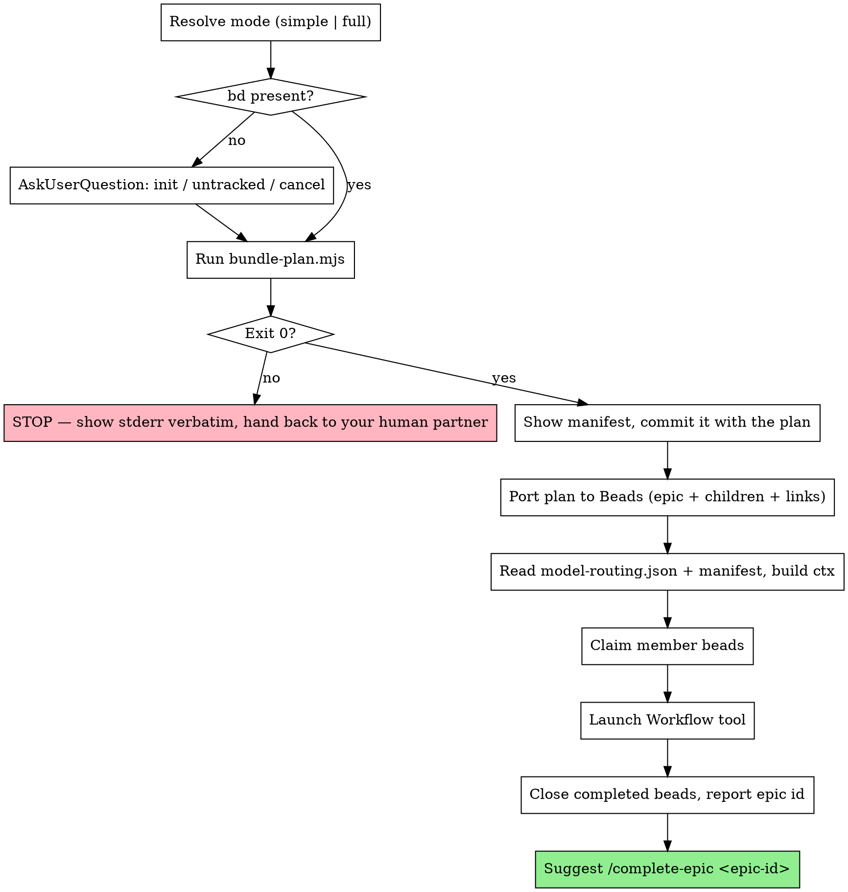

# Orchestrating Execution

**Announce at start:** "I'm using the orchestrating-execution skill to run this plan."

You are the coordinator. You do not implement anything. You prepare four things — a mode, a bundle
manifest, a Beads epic, and a routing map — hand them to `scripts/orchestrate.js`, and clean up
after it returns. Every line of code in this run is written by agents the workflow script dispatches.

**Why a script and not you:** `PreToolUse:Agent` hooks do not fire for Workflow `agent()` spawns
(measured 2026-08-13). Inside a workflow, the dispatch gate is blind, so the script *is* the
enforcement — it resolves every tier to a model itself and logs each dispatch. That only works if
you hand it well-formed input. Everything below exists to make the input well-formed.

## The Process



## Step 1: Resolve the mode

Your human partner already chose at the handoff. Map their choice to the literal the script expects:

| Handoff option | `mode` value | Pipeline |
|---|---|---|
| Orchestrated — Simple | `"simple"` | Implement → one combined review-and-fix pass → test loop |
| Orchestrated — Full | `"full"` | Implement → per-bundle + whole-epic review → routed fixes → test loop → refactor → test loop |

Lowercase, exactly `simple` or `full`. Anything else — `"Simple"`, `"Full mode"`, `undefined` —
makes `validateArgs` throw before a single agent is dispatched. Do not ask which mode; it was chosen.

You also need the plan path and its task file. They are co-located:
`docs/superpowers/plans/<name>.md` and `docs/superpowers/plans/<name>.md.tasks.json`. If the
`.tasks.json` is missing, STOP — there is nothing to bundle, and `writing-plans` should have written
it.

**Workspace:** the workflow's agents commit as they go, and the test loop deliberately leaves the
branch intact when it gives up. If you are on `main`/`master`, use
`claude-superpowers:using-git-worktrees` first, or get your human partner's explicit consent to run
here. Do not silently orchestrate a dozen agent commits onto a shared branch.

## Step 2: Beads check

```bash
command -v bd && test -d .beads && echo BEADS_OK
```

Both must hold. Beads is the durable record for the whole run: the workflow's implementer prompts
tell agents to run `bd show <id>` for their task detail, and the epic id is embedded in every commit
message the run produces.

If either check fails, ask — this is the only question this skill asks:

```yaml
AskUserQuestion:
  question: "CLARIFICATION: this repo has no Beads tracker (no `bd` on PATH, or no `.beads/` directory). Orchestrated execution normally uses Beads as the durable record of the plan. How should I proceed?"
  header: "Tracking"
  options:
    - label: "Initialise Beads"
      description: "Run `bd init` here, then port the plan into a new epic. Beads writes its own agent-instructions snippet and installs hooks that auto-inject `bd prime` at session start. (If `bd` is not installed at all I will stop and tell you how to install it.)"
    - label: "Continue untracked"
      description: "Run the plan with no tracker. Agents read task detail from the plan document instead of `bd show`; nothing records progress, and `/complete-epic` is unavailable afterwards."
    - label: "Cancel"
      description: "Stop here. The plan and its task file are already committed; nothing is lost."
```

The literal token `CLARIFICATION` in the question text is **required**. The
`pre-askuser-handoff-guard` hook is still armed at this point (writing-plans ran, tasks were
created), and that token is its escape hatch. Without it the hook blocks the call and teaches you to
re-issue the execution handoff menu, which would loop you back into this skill.

There is no tracking skill to defer to. `bd init` does the onboarding itself; do not go looking for
one.

## Step 3: Generate the bundle manifest

```bash
node "${CLAUDE_PLUGIN_ROOT}/scripts/bundle-plan.mjs" docs/superpowers/plans/<name>.md.tasks.json
```

It writes `<name>.md.bundles.json` beside the plan and prints `wrote <path> — N bundle(s) from M
task(s)`. Add `--stdout` to print instead of write; `--max-tasks N` / `--max-files N` raise the size
caps (defaults 5 and 15).

<HARD-GATE>
STOP if the exit code is non-zero. Show your human partner the script's stderr **verbatim** — every
character, in a code block — and hand the decision back to them. Do NOT partition the tasks
yourself, do NOT edit the manifest by hand, do NOT re-run with inflated `--max-*` values to make the
message go away.

The message is not an obstacle; it is the finding. It names the exact tasks, the exact shared files
forcing the merge, and the restructuring that fixes it. A non-zero exit means the *plan* has a
problem — usually several tasks writing one file that ought to be touched once, or a task whose
`json:metadata` fence carries no `modelTier`. Fixing the plan is your human partner's call, not
yours.
</HARD-GATE>

| Exit | Meaning | What to do |
|---|---|---|
| 0 | Manifest written | Continue to Step 4 |
| 1 | Plan content is wrong — missing/invalid `modelTier`, malformed metadata fence, bundle over cap, dependency cycle | STOP, surface stderr verbatim, fix the plan (with consent) and re-run |
| 2 | Invocation is wrong — no input path, input not ending in `.tasks.json`, bad `--max-*` value | STOP, fix your own command, re-run |

Valid tiers are `mechanical`, `standard`, `frontier`. The bundler refuses to default a missing one,
and so must you: a silent default here is an expensive silent default at dispatch time.

## Step 4: Show the manifest and commit it

Print the manifest to your human partner before launching anything — this is the cheapest moment in
the entire run to catch a bundling mistake. Summarise it as a table (bundle id, tier, task ids, file
count, blocked-by) and say plainly that implementation runs bundles in the array's order.

Then commit it alongside the plan:

```bash
git add docs/superpowers/plans/<name>.md.bundles.json
git commit -m "chore: bundle manifest for <plan title>"
```

The manifest is a reviewable, diffable artifact. It is not the script's input channel — see Step 6.

## Step 5: Port the plan into Beads

Skip this entire step when your human partner chose **Continue untracked** (see the untracked note
at the end of Step 6).

Create the epic:

```bash
EPIC=$(bd create "<plan title>" -t epic -p 1 --external-ref "docs/superpowers/plans/<name>.md" --json | jq -r '.id')
```

Then one child per task in `.tasks.json`, in plan order:

```bash
bd create "<task subject>" --parent "$EPIC" -t task -p 2 \
   -d "<Goal + Files + Steps>" --acceptance "<AC block>" \
   --external-ref "docs/superpowers/plans/<name>.md" --json | jq -r '.id'
```

- `-d` gets the task's full **Goal / Files / Steps** body, not a summary. The implementing agent
  reads this via `bd show` and nothing else — a one-line description makes it improvise.
- `--acceptance` gets the Acceptance Criteria block.
- Priority: `-p 2` for every child unless the plan says otherwise. Execution order comes from the
  manifest and the dependency links, never from priority.
- Descriptions contain backticks, quotes and newlines. Quoting them into `-d` is where this step
  breaks. Write the body to a temp file and pass `--body-file <tmp>` instead.

**Record the id map as you go: plan task id → bead id.** `.tasks.json` ids are integers (`10`, `11`,
…); bead ids look like `myproj-9rm.1`. Step 6 depends on this map and you cannot reconstruct it
later without guessing.

Replay each task's `blockedBy`:

```bash
bd link <blocked-bead-id> <blocker-bead-id>
```

<HARD-GATE>
**`bd link A B` means B blocks A.** The blocked task comes FIRST. Reversing the arguments inverts
the dependency graph silently — `bd` prints a cheerful success line either way. Before you run each
link, say the sentence out loud in your head: "A is blocked by B." If the plan says task 13 is
blocked by task 11, the command is `bd link <bead-for-13> <bead-for-11>`.
</HARD-GATE>

Bundles are never modelled in Beads. The bundle→bead relationship lives only in the manifest.

**Agents never close beads.** Not implementers, not fixers, not reviewers. Only this skill
transitions a bead to closed, and only in Step 7. This rule is carried into every agent prompt by
the `ctx` block below.

## Step 6: Launch the workflow

### 6a. Read the routing map

```bash
cat docs/superpowers/model-routing.json 2>/dev/null || cat ~/.claude/superpowers/model-routing.json
```

Project file first, then the user-level file. First one found wins entirely — no merging.

<HARD-GATE>
If neither file exists, STOP. Do not invent a mapping, do not name a model, do not pass a
hand-written `routing` object. Tell your human partner that orchestrated execution needs
`docs/superpowers/model-routing.json` and that `/onboard` writes it. Model names live in that file
and nowhere else — not in this skill, not in the script, not in your `args`.
</HARD-GATE>

Pass the parsed object through as `routing`, verbatim, including any extra keys (`effort`,
`sonnetEffort`, `enforceEffort`). The script reads only the three tier keys and ignores the rest.
`validateArgs` resolves every bundle's tier against this object up front, so a mapping missing a
tier that the plan uses fails before any spend.

### 6b. Rewrite the manifest's task ids to bead ids

The manifest's `taskIds` are `.tasks.json` integers. The workflow's implementer prompt says *"run
`bd show <id>`"* with exactly those values. Substitute the bead ids from your Step 5 map before
passing the bundles through, or every implementer's first command fails.

Change nothing else about the bundles array:

- **Preserve the array order exactly.** It is the execution order, and it is already topologically
  sorted. Bundle *ids* are not in order — `b2` legitimately precedes `b1` in the output. Sorting by
  id will reorder dependencies and `validateArgs` will reject it ("must name a bundle appearing
  earlier in the bundles array").
- Keep `id`, `tier` and `blockedByBundles` untouched. `files` is ignored by the script; leaving it
  in is harmless.

### 6c. Build `ctx`

`ctx` is prefixed onto every agent prompt in the run. Assemble it from the repo's `CLAUDE.md`
conventions and the plan's **Global Constraints** header. Keep it tight — it is paid for on every
dispatch — and it **MUST** end with the line `Do NOT run bd close.`

```
Project conventions:
- <the binding rules from CLAUDE.md: language, test command, commit style, house patterns>
- <the plan's Global Constraints, verbatim>
- Work on the current branch. Commit as you go. Never force-push, never rebase shared history.
- Claim nothing and close nothing in the tracker; the coordinator owns bead status.
Do NOT run bd close.
```

An empty or missing `ctx` is rejected by `validateArgs` — the check exists because a missing one
produced prompts that began with the literal string "undefined".

### 6d. Claim the member beads

```bash
bd update <bead-id> --claim
```

for every bead named in the manifest, immediately before launching. `--claim` is atomic and
idempotent, so re-running a partially-completed orchestration is safe. When resuming, guard
transitions with `--if-status <expected>`; it writes nothing and exits 13 on a mismatch, so a resume
cannot double-apply.

### 6e. Call the Workflow tool

```yaml
Workflow:
  scriptPath: "${CLAUDE_PLUGIN_ROOT}/scripts/orchestrate.js"
  args:
    mode: "full"                     # or "simple"
    routing: { ...parsed model-routing.json... }
    bundles: [ ...manifest bundles, taskIds rewritten to bead ids, order preserved... ]
    ctx: "...conventions block, ending in 'Do NOT run bd close.'..."
    epicId: "myproj-9rm"
```

<HARD-GATE>
**Pass parsed objects, never file paths.** Workflow scripts have no filesystem access. A
`"bundles": "docs/superpowers/plans/foo.md.bundles.json"` argument does not fail loudly — it fails
as `bundles must be a non-empty array`, and a path that happens to parse as something array-shaped
would fail far later and far weirder. You read the files; the script receives the data.
</HARD-GATE>

`validateArgs` runs before the first dispatch and throws on: a non-`simple`/`full` mode, empty
`ctx`, empty `epicId`, an empty or non-array `bundles`, a bundle with a blank or duplicate `id`, a
bundle whose `tier` is not one of the three, a tier with no model in `routing`, an empty `taskIds`,
or a `blockedByBundles` entry that does not name an earlier bundle. Every one of those is a
malformed-input bug on your side, not a plan problem — fix the `args` and relaunch.

The script announces its phases (Implement → Review → Fixes → Test → Refactor → Test) and returns
`{epicId, mode, bundles, findings, greenAfterImpl, greenAfterRefactor, notes}`.

**Untracked mode.** With no Beads, there are still hard requirements: `epicId` must be a non-empty
string — use the plan slug, e.g. `"untracked-2026-08-13-my-feature"` — and `taskIds` keep their
`.tasks.json` integers. Add to `ctx`: *"There is no Beads tracker in this repo. Ignore any
instruction to run `bd show` or `bd close`; read each task's full detail from
`docs/superpowers/plans/<name>.md`, where tasks are the `### Task N:` sections."* Skip Steps 5, 6b,
6d and the bead half of Step 7.

## Step 7: On completion

1. **Read the returned summary.** `greenAfterImpl` false means the test loop exhausted its two fix
   rounds and stopped with the branch intact — report the failing tests, and do not close the beads
   for work that is not green.
2. **Close the beads for completed bundles** — `bd close <id>` — from this skill and nowhere else.
   Leave anything unfinished `in_progress` so a resume can pick it up.
3. **Report the epic id** and a short outcome: bundles run, findings count, test state.
4. **Suggest `/complete-epic <epic-id>`** and stop there. That command already owns evidence
   gathering, follow-up filing, the retrospective and epic closure. Do not write a completion
   report, do not file follow-ups, do not close the epic yourself.

## Anti-Patterns

| Anti-pattern | Reality |
|---|---|
| Bundling by hand after `bundle-plan.mjs` fails | The script exists precisely because a model doing set arithmetic by eye is inconsistent and fails silently. Its stderr names the tasks and files to restructure — surface it and stop. |
| Raising `--max-tasks`/`--max-files` to clear a cap breach | The cap is a smell test that just found a real plan defect: several tasks writing one file. Raising it hides the defect and ships an oversized bundle. Only your human partner may decide the cap was genuinely too low. |
| Letting agents close beads | Agents close on optimism, mid-run, before review and tests have spoken. The coordinator holds the only close. `Do NOT run bd close.` stays in `ctx` verbatim. |
| Passing a file path where the script expects data | Workflow scripts have no filesystem access. `bundles` and `routing` must be parsed objects in `args`. |
| Defaulting a missing tier to `standard` | Neither the bundler nor the script defaults a tier, and neither do you. A guessed tier is a silent, recurring cost or capability error at every dispatch. |
| Writing a model name into `args`, the skill, or a prompt | Tiers only. `model-routing.json` is the single place a tier becomes a model. Model lineups change; plans and skills survive. |
| Sorting the bundles array by id before launching | The array is already topologically sorted and its ids are deliberately not in order. Sorting breaks the dependency contract and `validateArgs` rejects it. |
| Passing the manifest's integer `taskIds` straight through when Beads is in use | Agents are told to run `bd show <id>`. Integers are not bead ids; every implementer's first command fails. |
| Implementing a task yourself "since it's small" | You are the coordinator. Work happens inside the workflow, where routing is enforced and each dispatch is logged. Your edits are neither. |
| Writing your own completion report at the end | `/complete-epic` owns that, with evidence. Duplicating it produces two accounts of the same run that will disagree. |

## Red Flags — STOP

- You are about to edit `<plan>.bundles.json` in a text editor.
- You are about to summarise, paraphrase or truncate a `bundle-plan.mjs` error.
- You are typing a model name anywhere.
- You are about to run `bd link` without having said "A is blocked by B" to yourself first.
- Your `ctx` string does not end with `Do NOT run bd close.`
- You are about to call the Workflow tool with a string where an object belongs.
